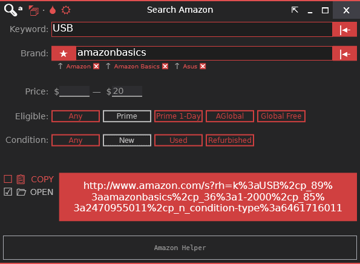

# Search Amazon (WPF)
**Last Updated:** 06 November 2014

This is the code repository for a WPF app called "Search Amazon". 
It's purpose is to search Amazon products with filters, using query parameters.

**NOTE:** I have remade this project as a web app: 
[SEARCH-PRIME: The easy way to search Amazon.](https://prime.staticvoidmain.app/)

This app uses my own Window template which includes:
- Dark/White Theme
- Color Schemes
- Always On-Top option.
- In-place Collapse/Expand
